# Git Workflow Research & Analysis for SaaS Enterprises

## Executive Summary

This document analyzes popular Git workflows implemented by successful SaaS enterprises, examining how they address common development challenges including fast feature deployment, bug fixing, QA bottlenecks, and code review processes. The research covers four primary workflows: **Trunk-Based Development**, **GitHub Flow**, **GitLab Flow**, and **Traditional GitFlow**.

Based on current industry trends (2025-2026), **Trunk-Based Development** and **GitHub Flow** have emerged as the dominant strategies for SaaS companies prioritizing speed, continuous deployment, and rapid iteration.

---

## Quick Start: Key Terms Explained (For Junior Developers)

If you're new to Git workflows or some terms are confusing, start here! This glossary will help you understand the concepts used throughout this document.

| Term | Simple Explanation | Real-World Analogy |
|------|-------------------|-------------------|
| **Main/Trunk Branch** | The primary branch that represents your production code. Always stable and deployable. | The main highway that everyone uses. Should always be safe to drive on. |
| **Feature Branch** | A temporary branch where you develop a new feature. Gets deleted after merging. | A side road you build to add a new shop. Once built, it connects back to the main highway. |
| **Pull Request (PR)** | A request to merge your code changes into another branch. Team reviews it first. | Asking permission to connect your side road to the main highway. Others check it's safe first. |
| **Merge** | Combining code from one branch into another branch. | Connecting your side road to the main highway. |
| **Merge Conflict** | When two people edit the same code differently. Git doesn't know which version to keep. | Two construction crews trying to build on the same spot. You need to decide which design to use. |
| **CI/CD Pipeline** | Automated system that tests, builds, and deploys your code without manual work. | A robot assembly line that automatically checks quality and ships your product. |
| **Deployment** | The process of releasing your code to an environment (staging or production). | Delivering your product to the store shelves where customers can access it. |
| **Staging Environment** | A copy of production where you test changes before releasing to real users. | A practice stage before the real performance. Looks identical to the real stage. |
| **Production Environment** | The live system where real users access your application. | The actual store where customers shop. |
| **Hotfix** | An urgent bug fix that needs to go to production immediately. | Emergency repair to fix a broken door at the store. Can't wait for scheduled maintenance. |
| **Feature Flag** | Code that lets you turn features on/off without redeploying. Like a light switch. | A light switch for features. Deploy the wiring (code) but control the light (feature) separately. |
| **Automated Tests** | Code that automatically checks if your application works correctly. | Quality control robots that test every feature before shipping. |
| **Code Review** | Team members read your code to catch bugs and suggest improvements. | A colleague proofreading your essay before you submit it. |
| **Cherry-Pick** | Copying specific commits from one branch to another. | Picking specific fruits from one basket and moving them to another. |
| **Continuous Integration (CI)** | Automatically merging and testing code changes frequently (multiple times per day). | Assembly line that continuously adds pieces and checks quality at each step. |
| **Continuous Deployment (CD)** | Automatically deploying code to production after it passes tests. | Packages automatically shipped to customers as soon as quality check passes. |
| **Rollback** | Reverting to a previous version of code when something breaks. | Hitting "undo" to go back to the last working version. |
| **Trunk-Based Development** | Everyone commits to main branch frequently (daily). No long-lived feature branches. | Everyone works on the main highway. No long detours. |
| **Long-Lived Branch** | A branch that exists for weeks/months. Can cause big merge conflicts. | A side road that's under construction for months. Hard to reconnect to the updated main highway. |
| **Short-Lived Branch** | A branch that lives for hours/days, then gets merged and deleted. | A temporary detour that quickly reconnects to the main road. |

---

## Workflow Quick Reference (TL;DR)

**Pick Your Workflow:**

```
┌─────────────────────────────────────────────────────────────────┐
│  Need MAXIMUM speed + have excellent automation?                │
│  → Use TRUNK-BASED DEVELOPMENT                                  │
│     Deploy: 50+ times/day                                        │
│     Best for: Netflix, Google, Facebook                          │
└─────────────────────────────────────────────────────────────────┘

┌─────────────────────────────────────────────────────────────────┐
│  Need simplicity + fast deployment?                             │
│  → Use GITHUB FLOW                                              │
│     Deploy: Multiple times/day                                   │
│     Best for: Startups, small SaaS teams                         │
└─────────────────────────────────────────────────────────────────┘

┌─────────────────────────────────────────────────────────────────┐
│  Need staging environment + reasonable speed?                   │
│  → Use GITLAB FLOW                                              │
│     Deploy: Daily to weekly                                      │
│     Best for: Enterprise SaaS, regulated industries              │
└─────────────────────────────────────────────────────────────────┘

┌─────────────────────────────────────────────────────────────────┐
│  Have scheduled releases + manual QA?                           │
│  → Use GITFLOW (but consider modernizing!)                      │
│     Deploy: Weekly to monthly                                    │
│     Best for: Legacy systems, boxed software                     │
└─────────────────────────────────────────────────────────────────┘
```

**Your Situation (Based on Problem Statement):**
- ✅ Small-medium company (QA:Dev = 1:10)
- ✅ Need to ship features FAST
- ✅ Need to fix bugs FAST
- ⚠️ Code review is a bottleneck
- ⚠️ QA involved too late

**Recommended:** **GitHub Flow + GitLab Flow Hybrid** (Section 5)

---

## 1. Industry Landscape & Trends

### Current State of Git Workflows (2025-2026)

The software development industry has undergone a significant shift in deployment practices:

- **Most teams in 2026 aren't shipping quarterly releases. They're deploying multiple times per day.**
- The conversation has shifted - in 2018, teams debated whether trunk-based development was even viable, but in 2026, the question is "Why aren't you doing trunk-based development yet?"
- Monthly pushes passed 82M, merged PRs hit 43M, with roughly 41% of commits being AI-assisted and 84% of developers having adopted AI coding tools.

### Key Industry Drivers

1. **Speed to Market**: SaaS companies need to ship features rapidly to remain competitive
2. **Continuous Feedback**: Faster deployment cycles enable quicker customer feedback loops
3. **Reduced Risk**: Smaller, incremental changes are less risky than large batch releases
4. **Automation**: Modern CI/CD tooling makes continuous deployment practical and reliable

---

## 2. Popular Git Workflows in SaaS Enterprises

### 2.1 Trunk-Based Development (TBD)

**Companies Using This**: Google, Facebook (Meta), Netflix, Spotify (modified version)

#### Overview

Trunk-based development is a version control management practice where developers merge small, frequent updates to a core "trunk" or main branch. It's the most aggressive approach to continuous integration.

#### Key Characteristics

- **Single Main Branch**: All development happens on or very close to the main/trunk branch
- **Short-Lived Feature Branches**: Branches live for less than 2 days, often less than 24 hours
- **Frequent Integration**: Developers commit to trunk at least once per day
- **Feature Flags**: Incomplete features are hidden behind feature toggles rather than branches
- **Continuous Deployment**: Main branch is always deployable to production

#### How It Works

1. Developer creates a short-lived feature branch from main
2. Development work is broken into small, incremental changes
3. Branch is merged back to main within 24 hours
4. Automated tests run on every commit
5. Feature flags control feature visibility in production
6. Deployment happens automatically or on-demand from main

#### Workflow Diagram


**Visual Flow Explanation:**
```
Developer A                    Developer B                    Main Branch              Production
    |                              |                              |                         |
    |--[create branch]------------>|                              |                         |
    |--[commit small change]------>|                              |                         |
    |--[commit small change]------>|                              |                         |
    |--[create PR]---------------->|                              |                         |
    |                              |--[automated tests run]------>|                         |
    |                              |--[merge to main]------------>|                         |
    |                              |                              |--[auto-deploy]--------->|
    |                              |                              |                    [Feature Flag: OFF]
    |                              |                              |                    [Enable flag gradually]
    |                              |                              |                    [Feature Flag: ON]
```

**Key Point for Junior Devs:** Think of main branch as a highway - everyone merges onto it frequently (multiple times a day). Your feature branch is like a short side road that quickly reconnects to the highway within 24 hours. This keeps traffic flowing smoothly!

#### Company-Specific Implementations

**Google**:
- Uses Perforce for their trunk with additional tooling
- Many developers use Git on local workstations with in-house bridge for Perforce interop
- Massive monorepo with billions of lines of code
- Deploy over 50 times per day

**Facebook (Meta)**:
- Uses Mercurial with additional tooling for central server/repo
- Extensive use of feature flags for progressive rollouts
- Automated testing at massive scale

**Netflix**:
- Trunk-based development with microservices architecture
- Deploy to production over 100 times per day
- Heavy reliance on automated testing and monitoring

#### Challenges Addressed

| Challenge | How TBD Addresses It |
|-----------|---------------------|
| **Fast Feature Shipping** | Small, incremental changes enable multiple deployments per day. Feature flags decouple deploy from release. |
| **Bug Fixing / Hotfixes** | No need for separate hotfix branches. Fix in main and deploy immediately. Average fix deployment time under 10 minutes. |
| **Code Review Bottleneck** | Small PRs (200-400 lines) are reviewed faster. Merge queue automation prevents conflicts. AI-powered review tools reduce review time by 50%. |
| **QA Late Involvement** | Shift-left testing integrates QA from requirements phase. Automated tests run on every commit. |
| **Merge Conflicts** | Eliminated through frequent integration. Conflicts caught and resolved within hours, not days/weeks. |

#### Why It Works

1. **Continuous Integration by Design**: Forces teams to maintain a stable main branch
2. **Fast Feedback**: Issues are caught within hours, not at release time
3. **Reduced Complexity**: No long-lived branches means no complex merges
4. **Deployment Confidence**: Automated testing provides safety net for frequent deployments
5. **Business Agility**: Can respond to market changes and bugs within hours

---

### 2.2 GitHub Flow

**Companies Using This**: GitHub (obviously), Shopify, Heroku, and many small-to-medium SaaS startups

#### Overview

GitHub Flow is a lightweight variant where all work happens on short-lived feature branches off main, and main is always deployable. It's simpler than GitFlow but more structured than pure trunk-based development.

#### Key Characteristics

- **Main Branch Always Deployable**: Main represents production-ready code
- **Feature Branches**: Each feature/fix gets its own branch from main
- **Pull Requests**: All changes go through PR review before merging
- **Deploy from Main**: Production deployments happen from main branch
- **No Release Branches**: Continuous deployment model

#### How It Works

1. Create feature branch from main: `feature/user-authentication`
2. Develop feature with regular commits
3. Open Pull Request when ready for review
4. Team reviews PR, automated tests run
5. Merge to main after approval
6. Automatic deployment to production from main
7. Monitor production, rollback if needed

#### Workflow Diagram


**Step-by-Step Timeline:**
```
Day 1 Morning:    Create branch feature/user-auth from main
Day 1 Afternoon:  Write code, commit changes
Day 2 Morning:    Open Pull Request
Day 2 Midday:     Team reviews, automated tests run
Day 2 Afternoon:  Merge to main → Auto-deploy to production
Day 2 Evening:    Monitor production metrics

Total time: ~1-2 days from start to production
```

**Key Point for Junior Devs:** GitHub Flow is like a simple assembly line: build your feature → get it checked → ship it to customers. No complex branching strategies, just one main branch that always represents what's in production!

#### Best For

- Small teams (under 10 developers)
- Web applications with single production version
- Cloud-based or SaaS applications requiring frequent updates
- Teams with strong automated testing culture

#### Challenges Addressed

| Challenge | How GitHub Flow Addresses It |
|-----------|----------------------------|
| **Fast Feature Shipping** | Direct path from main to production. No intermediate branches or manual release processes. |
| **Bug Fixing / Hotfixes** | Same process as features. Fix branch → PR → Merge → Deploy. Typically under 30 minutes. |
| **Code Review Bottleneck** | Streamlined PR process. Small, focused PRs get faster reviews. Merge queue prevents conflicts. |
| **QA Late Involvement** | QA can test feature branches before merge. Automated tests provide continuous validation. |
| **Deployment Speed** | Can deploy multiple times per day. Average deployment time: 5-15 minutes. |

#### Why It Works

1. **Simplicity**: Easy to understand and adopt
2. **CI/CD Alignment**: Perfect fit for continuous deployment pipelines
3. **Quick Iterations**: Short cycle from code to production
4. **Clear Process**: Everyone follows same workflow
5. **Automated Safety**: Tests and checks prevent bad code from reaching production

---

### 2.3 GitLab Flow

**Companies Using This**: GitLab, enterprises with multiple environments, regulated industries

#### Overview

GitLab Flow bridges the gap between GitHub Flow and traditional GitFlow. It adds environment branches (staging, production) while maintaining simpler workflows than GitFlow.

#### Key Characteristics

- **Main Branch**: Primary development branch
- **Environment Branches**: Separate branches for staging and production
- **Upstream First**: Fixes go to main first, then cherry-picked downstream
- **Release Branches**: Optional for versioned releases
- **Issue Tracking Integration**: Tight integration with issue/ticket systems

#### How It Works

**For Continuous Deployment (SaaS Model)**:
1. Developer creates feature branch from main
2. Develop and create Merge Request
3. After approval, merge to main
4. Main automatically deploys to staging environment
5. After QA approval, merge main changes to production branch
6. Production branch automatically deploys to production

**For Versioned Releases**:
1. Create release branch from main: `release/2.1`
2. Bug fixes merged to main first
3. Cherry-pick fixes to release branches as needed
4. Deploy from release branches

#### Workflow Diagram (Continuous Deployment for SaaS)


**Environment Flow Visualization:**
```
┌─────────────────┐
│ Developer       │
│ Local Machine   │
└────────┬────────┘
         │
         │ (1) git push feature branch
         ↓
┌─────────────────┐
│  Main Branch    │  ← All features merge here first
└────────┬────────┘
         │
         │ (2) Auto-deploy on merge
         ↓
┌─────────────────┐
│ Staging Env     │  ← QA tests here (looks like production)
│ staging.app.com │
└────────┬────────┘
         │
         │ (3) After QA approval, merge main → production branch
         ↓
┌─────────────────┐
│ Production Env  │  ← Real customers use this
│ app.com         │
└─────────────────┘
```

**Hotfix Flow (Upstream First):**


**Key Point for Junior Devs:** GitLab Flow adds a "safety net" (staging environment) before production. It's like having a practice stage before the real performance. You always fix bugs in the main branch first (upstream), then carefully move them to production (downstream).

#### Best For

- Organizations needing multiple stable environments
- Teams requiring staging/pre-production validation
- Enterprises with compliance requirements
- Products with multiple supported versions

#### Challenges Addressed

| Challenge | How GitLab Flow Addresses It |
|-----------|----------------------------|
| **Fast Feature Shipping** | Staging environment provides safety before production. Typically 1-2 day cycle from main to production. |
| **Bug Fixing / Hotfixes** | Fix in main, cherry-pick to production. Maintains code consistency across environments. |
| **Code Review Bottleneck** | Merge Request process with automated checks. Parallel reviews possible for multiple features. |
| **QA Late Involvement** | Dedicated staging environment for QA validation. QA can start testing as soon as code hits staging. |
| **Environment Isolation** | Clear separation between staging and production. Reduces production incidents. |

#### Why It Works

1. **Environment Safety**: Staging acts as production mirror for validation
2. **Upstream First**: Ensures fixes in main don't get lost
3. **Flexibility**: Supports both continuous and versioned release models
4. **Compliance Ready**: Environment branches satisfy audit requirements
5. **Gradual Rollout**: Changes progress through environments systematically

---

### 2.4 Traditional GitFlow

**Companies Using This**: Legacy enterprises, teams with scheduled releases, boxed software companies

#### Overview

GitFlow is the original branching model created by Vincent Driessen in 2010. It uses multiple long-lived branches and a formal release process. **Note: Most modern SaaS companies have moved away from this model.**

#### Key Characteristics

- **Multiple Long-Lived Branches**: develop, main/master
- **Supporting Branches**: feature, release, hotfix
- **Formal Release Process**: Release branches for UAT/QA
- **Scheduled Releases**: Typically weekly, bi-weekly, or monthly
- **Complex Merge Strategy**: Multiple merge paths between branches

#### How It Works

1. Features developed in feature branches from develop
2. Feature branches merged back to develop
3. Release branch created from develop when ready
4. QA tests release branch
5. Release branch merged to both main and develop
6. Hotfixes branched from main, merged to both main and develop

#### Workflow Diagram


**Complex Branch Structure:**
```
                    Feature Branches
                    /            \
                   /              \
    feature/login  feature/payment  feature/dashboard
           \            |              /
            \           |             /
             \          |            /
              ↓         ↓           ↓
         ┌──────────────────────────┐
         │   Develop Branch         │  ← Integration branch
         │   (Next Release)         │
         └────────────┬─────────────┘
                      │
                      │ When ready for release
                      ↓
         ┌──────────────────────────┐
         │   Release Branch         │  ← QA tests here
         │   release/2.0            │
         └─────┬──────────────┬─────┘
               │              │
               ↓              ↓
         ┌──────────┐   ┌──────────┐
         │  Main    │   │ Develop  │  ← Merged to BOTH
         │ (Prod)   │   │          │
         └──────────┘   └──────────┘
               ↑
               │ Emergency only
         ┌──────────┐
         │ Hotfix   │
         │ Branch   │
         └──────────┘
```

**Why This Is Complex (Especially for SaaS):**
```
Week 1: Dev A works on feature/login    (branch lives 1 week)
Week 1: Dev B works on feature/payment  (branch lives 1 week)
Week 2: Both merge to develop
Week 2: Create release/2.0 from develop
Week 3: QA finds bugs in release/2.0
Week 3: Fix bugs in release branch
Week 3: Merge release to BOTH main AND develop (potential conflicts!)
Week 3: If production bug found, create hotfix from main
Week 3: Merge hotfix to BOTH main AND develop (more conflicts!)

Result: Long-lived branches + multiple merge paths = MERGE HELL 😱
```

**Key Point for Junior Devs:** GitFlow is like a complex multi-lane highway system with many intersections. While organized, it creates traffic jams (merge conflicts) and takes longer to reach your destination (production). This is why most modern SaaS companies have moved to simpler workflows!

#### When It Might Still Be Appropriate

- Desktop/mobile apps with App Store review cycles
- Enterprise software with quarterly release schedules
- Teams with extensive manual QA processes
- Organizations with regulatory approval requirements

#### Challenges Addressed (and Limitations)

| Challenge | GitFlow Approach | Limitation for SaaS |
|-----------|-----------------|-------------------|
| **Fast Feature Shipping** | Scheduled releases bundle features | Too slow for competitive SaaS market |
| **Bug Fixing / Hotfixes** | Hotfix branches from main | Added complexity, slower than direct fix to main |
| **Code Review Bottleneck** | Same as other flows | Multiple merge paths create additional review burden |
| **QA Late Involvement** | Dedicated release branch for QA | QA still happens late, batched testing inefficient |
| **Merge Conflicts** | Can be extensive in release branches | Significant merge conflicts common |

#### Why It's Falling Out of Favor for SaaS

1. **Too Complex**: Overhead doesn't justify benefits for continuous deployment
2. **Slow**: Release cycle typically weekly or longer
3. **Merge Hell**: Long-lived branches create significant merge conflicts
4. **Doesn't Match CI/CD**: Modern tooling expects simpler workflows
5. **Business Risk**: Slow releases mean slow response to market changes

---

## 3. Supporting Practices for Modern Git Workflows

### 3.1 Feature Flags (Feature Toggles)

Modern SaaS companies use feature flags to decouple deployment from release:

**Benefits**:
- Deploy incomplete code safely to production
- Progressive rollouts (1% → 5% → 20% → 100%)
- Instant rollback without code deployment
- A/B testing and experimentation
- Kill switches for problematic features

**How Teams Use Them**:
- Hide unfinished functionality behind flags disabled in production
- Gradually enable for user segments (internal → beta → all)
- Roll back by flipping flag, not rolling back deployment
- Fix bugs without emergency deploys

**ROI**: Companies report 400%+ ROI in first year from feature flag adoption.

#### Feature Flags Workflow Diagram


**Progressive Rollout Example:**
```
Monday 9 AM:   Deploy code with feature flag OFF
               → All users see old checkout flow

Monday 10 AM:  Enable flag for 1% of users (internal team)
               → 99% old flow, 1% new flow
               Monitor: error rates, conversion, performance

Monday 2 PM:   No issues! Increase to 5% (beta users)
               → 95% old flow, 5% new flow

Tuesday 9 AM:  Still good! Increase to 25%
               → 75% old flow, 25% new flow

Wednesday:     Increase to 50%

Thursday:      Enable for 100% of users
               → Everyone on new checkout flow

If ANY issues: Turn flag OFF immediately
               → Instant rollback, no code deployment needed!
```

**Code Example (Simple Explanation):**
```javascript
// Feature flag in your code
if (featureFlags.isEnabled('new-checkout-flow')) {
    // New code - only runs if flag is ON
    showNewCheckoutFlow();
} else {
    // Old code - safe fallback
    showOldCheckoutFlow();
}
```

**Key Point for Junior Devs:** Feature flags are like light switches for your code. You can deploy new code to production but keep it "turned off" until you're ready. Then gradually "turn on the lights" for more users. If something breaks, just flip the switch back - no need to redeploy!

### 3.2 Shift-Left Testing

Moving testing earlier in the development lifecycle addresses QA bottlenecks:

**Key Principles**:
1. **Early QA Involvement**: QA involved from requirements gathering
2. **Continuous Validation**: Tests run on every commit
3. **Enhanced Collaboration**: QA, developers, and product work together from start

**Benefits for SaaS**:
- Bug found before implementation: $650
- Bug found during testing: $1,500
- Bug found in production: $10,000
- **Teams report 200% faster shipping with 70%+ test coverage**

**Implementation**:
- Integrate QA in story grooming
- Automated tests in CI/CD pipelines
- Test-driven development (TDD)
- Continuous feedback loops

#### Shift-Left Testing Diagram

**Traditional Approach (QA at the End):**


**Shift-Left Approach (QA from the Start):**


**Timeline Comparison:**
```
TRADITIONAL (QA at End):
Week 1-2:  Development ━━━━━━━━━━━━━━━━
Week 3:    QA Testing           ━━━━ (finds 20 bugs!)
Week 4:    Fix bugs                   ━━━━
Week 5:    Re-test                        ━━━━
Total: 5 weeks, high stress, expensive bugs

SHIFT-LEFT (QA Throughout):
Day 1:     Requirements + QA ━
Day 2-10:  Dev + Auto Tests   ━━━━━━━━━━ (catches bugs immediately)
Day 11-12: Final QA           ━━ (finds 2 minor bugs)
Day 13:    Deploy             ━
Total: ~2 weeks, low stress, cheap bug fixes
```

**The Cost Impact:**
```
┌──────────────────┬────────────┬──────────────┐
│ When Bug Found   │    Cost    │     Time     │
├──────────────────┼────────────┼──────────────┤
│ Requirements     │    $650    │   1 hour     │
│ Development      │  $1,500    │   4 hours    │
│ QA/Testing       │  $3,000    │   1 day      │
│ Production       │ $10,000    │   1 week     │
└──────────────────┴────────────┴──────────────┘

Finding bugs early = 15x cheaper! 💰
```

**Key Point for Junior Devs:** Traditional testing is like checking if your car works AFTER driving cross-country. Shift-left is like checking it BEFORE you leave, at every gas station, and while driving. You catch problems when they're small and cheap to fix!

### 3.3 Automated Code Review

Addressing the code review bottleneck with automation:

**The Problem**:
- AI increases code production, but review capacity stays constant
- 40% quality deficit projected for 2026
- Manual reviews can't keep pace with AI-assisted development

**Solutions**:
- **AI-Powered Review Tools**: Reduce review time by 50%, catch 3X more bugs
- **Merge Queues**: Automate conflict resolution and test orchestration
- **Small PRs**: Keep PRs to 200-400 lines for faster review
- **Automated Checks**: Security scans, lint checks, test coverage run automatically

**Best Practices**:
- Enforce automated checks before human review
- Use merge queues to handle CI/CD conflicts
- Keep PRs small and focused
- Leverage AI to handle routine checks

### 3.4 Continuous Integration/Continuous Deployment (CI/CD)

Modern workflows require robust CI/CD infrastructure:

**Essential Components**:
- **Automated Testing**: Unit, integration, E2E tests run on every commit
- **Fast Build Times**: Complete in minutes, not hours
- **Automated Deployment**: From merge to production in under 15 minutes
- **Monitoring & Rollback**: Quick detection and reversion of issues

**Performance Targets**:
- Test suite completion: < 30 minutes
- Mean time to repair (MTTR): < 10 minutes
- Deployment frequency: Multiple times per day
- Change failure rate: < 15%

#### CI/CD Pipeline Diagram


**Complete Pipeline Timeline:**
```
00:00  Developer pushes code to GitHub
00:01  CI/CD detects new commit, starts pipeline
00:01  ├─ Install dependencies (1 min)
00:02  ├─ Run linter/code quality (1 min)
00:03  ├─ Run unit tests (2 mins) ✓
00:05  ├─ Run integration tests (5 mins) ✓
00:10  ├─ Run E2E tests (10 mins) ✓
00:20  ├─ Security vulnerability scan (3 mins) ✓
00:23  ├─ Build application bundle (5 mins) ✓
00:28  ├─ Deploy to staging environment (2 mins) ✓
00:30  └─ Run smoke tests on staging (3 mins) ✓

Total: 33 minutes from code commit to staging deployment

After QA approval (few hours later):
00:00  Deploy to production (5 mins)
00:05  Run production smoke tests (3 mins)
00:08  Monitor metrics, alert if issues

Total: < 8 hours from code to production customers 🚀
```

**What Happens Automatically (No Human Intervention):**
```
┌─────────────────────────────────────────┐
│  AUTOMATED (CI/CD handles this)         │
├─────────────────────────────────────────┤
│  ✓ Code quality checks                  │
│  ✓ Run all tests (unit, integration)    │
│  ✓ Security vulnerability scanning      │
│  ✓ Build application                    │
│  ✓ Deploy to staging                    │
│  ✓ Smoke tests                          │
│  ✓ Notify team of results               │
└─────────────────────────────────────────┘

┌─────────────────────────────────────────┐
│  MANUAL (Humans decide)                 │
├─────────────────────────────────────────┤
│  • Code review and approval             │
│  • QA validation in staging             │
│  • Decision to deploy to production     │
│  • Monitor production metrics           │
└─────────────────────────────────────────┘
```

**Key Point for Junior Devs:** CI/CD is like an assembly line robot that automatically tests, builds, and deploys your code. You write code, push it, and the robot handles all the repetitive testing and deployment tasks. If anything breaks, the robot stops and alerts you immediately!

---

## 4. Comparative Analysis

### 4.1 Pros & Cons Summary

#### Trunk-Based Development

| Pros | Cons |
|------|------|
| Fastest deployment cycle (deploy 50+ times/day) | Requires exceptional discipline and automated testing |
| Eliminates merge conflicts through frequent integration | Steep learning curve for teams used to feature branches |
| Forces continuous integration practices | Incomplete features must use feature flags |
| Simplest branching model | Requires cultural shift and strong DevOps practices |
| Excellent CI/CD alignment | Can feel risky without robust automation |
| Enables true continuous deployment | All developers must commit daily |
| Small changes reduce risk | Not suitable for manual QA processes |
| Fast feedback loops | Feature flag management adds complexity |

#### GitHub Flow

| Pros | Cons |
|------|------|
| Simple and easy to understand | Assumes you can always deploy to production |
| Clear path from development to production | No staging environment in base model |
| Works well with CI/CD pipelines | Limited version control for multiple releases |
| Fast deployment (5-15 minutes average) | May not meet compliance requirements |
| Reduces complexity compared to GitFlow | Rollbacks require new deployment |
| Encourages small, frequent releases | Less suitable for scheduled releases |
| Easy to onboard new developers | Testing must happen before merge |
| Single production version simplifies support | Not ideal for enterprise with change approval processes |

#### GitLab Flow

| Pros | Cons |
|------|------|
| Balances speed with environment safety | More complex than GitHub Flow |
| Supports multiple environments (staging, production) | Cherry-picking can miss commits |
| Upstream-first prevents lost fixes | Extra merge step to production (1-2 day delay) |
| Flexible for both continuous and versioned releases | Requires discipline to maintain upstream-first |
| Better for compliance and audit requirements | Environment branches can drift |
| Staging environment reduces production incidents | More branches to maintain |
| Works for organizations needing controlled releases | Not as fast as trunk-based or GitHub Flow |
| Issue tracking integration improves traceability | Can become complex with many environments |

#### Traditional GitFlow

| Pros | Cons |
|------|------|
| Well-documented and widely understood | Too complex for modern SaaS development |
| Clear separation of concerns | Slow release cycle (weekly or longer) |
| Formal release process with QA phase | Extensive merge conflicts common |
| Supports scheduled releases well | Multiple long-lived branches to maintain |
| Hotfix branches for production fixes | QA involvement still late in cycle |
| Works for regulated industries with approval gates | Doesn't align with continuous deployment |
| Good for supporting multiple versions | High overhead for simple features |
| Predictable release schedule | Business risk from slow market response |

### 4.2 Visual Workflow Comparison


**Complexity Comparison (Fewer branches = Simpler):**
```
Trunk-Based:     Main ━━━━━━━━━━━━━━━━━━━━━━━━━━━━━━
                  └─ tiny branches (< 1 day)

GitHub Flow:     Main ━━━━━━━━━━━━━━━━━━━━━━━━━━━━━━
                  ├─ feature/A (1-2 days)
                  ├─ feature/B (1-2 days)
                  └─ feature/C (1-2 days)

GitLab Flow:     Main ━━━━━━━━━━━━━━━━━━━━━━━━━━━━━━
                  ├─ feature/A (2-3 days)
                  ├─ feature/B (2-3 days)
                Production ━━━━━━━━━━━━━━━━━━━━━━━━

GitFlow:         Develop ━━━━━━━━━━━━━━━━━━━━━━━━━━
                  ├─ feature/A (1-2 weeks)
                  ├─ feature/B (1-2 weeks)
                  ├─ release/1.0 (1 week)
                  └─ hotfix/critical (1 day)
                Main ━━━━━━━━━━━━━━━━━━━━━━━━━━━━━━
```

### 4.3 Workflow Selection Matrix

| Factor | Trunk-Based Development | GitHub Flow | GitLab Flow | GitFlow |
|--------|------------------------|-------------|-------------|----------|
| **Team Size** | Any (requires maturity) | Small-Medium (<20) | Medium-Large | Any |
| **Deployment Frequency** | Multiple times per day | Multiple times per day | Daily to weekly | Weekly to monthly |
| **QA Process** | Fully automated | Mostly automated | Mix of automated + manual | Manual-heavy |
| **Industry** | SaaS, Web Apps | SaaS, Startups | Enterprise SaaS, Regulated | Legacy, Boxed Software |
| **CI/CD Maturity** | Very High (Required) | High (Required) | Medium-High | Low-Medium |
| **Release Model** | Continuous | Continuous | Continuous or Scheduled | Scheduled |
| **Compliance Needs** | Low (with proper controls) | Low | Medium-High | High |
| **Learning Curve** | High | Low | Medium | Medium |
| **Merge Complexity** | Very Low | Low | Medium | High |
| **Time to Production** | Hours | Hours to 1 day | 1-2 days | 1-4 weeks |

---

## 5. Recommendations for Your Organization

Based on your stated challenges and context (QA:Dev ratio of 1:10, need for fast shipping, 3 interconnected applications):

### Primary Recommendation: **GitHub Flow with GitLab Flow Hybrid**

**Why This Approach**:

1. **Addresses Fast Shipping**: Direct path to production via main branch
2. **Handles Hotfixes**: Same process as features, no special branches needed
3. **Reduces Code Review Bottleneck**:
   - Smaller, focused PRs
   - Automated checks before human review
   - Merge queue automation
4. **Improves QA Involvement**:
   - Staging environment for testing before production
   - QA can start testing as soon as code merges to main/staging
   - Automated test suite reduces manual QA burden

**Proposed Structure**:

```
main (staging environment)
  ↓
production (production environment)

Feature branches:
ST-XXX/FEAT/<name> → merge to main → auto-deploy to staging → QA tests → merge to production
ST-XXX/FIX/<name> → merge to main → auto-deploy to staging → QA tests → merge to production
ST-XXX/HOTFIX/<name> → merge to main → fast-track to production (< 1 hour)
```

#### Visual Comparison: Current vs Recommended Workflow

**Your CURRENT Workflow (Full Deployment):**

```mermaid
graph TD
    A[master branch<br/>STAGING env] --> B[Dev creates<br/>ST-XXX/FEAT branch]
    B --> C[Development<br/>Days/Weeks]
    C --> D[Create PR to master]
    D --> E[QA triggers merge]
    E --> A
    A --> F[Many features<br/>accumulate in master]
    F --> G[Weekly: Create<br/>DEPLOYMENT-date branch<br/>from production]
    G --> H[Merge master<br/>into deployment branch<br/>😱 MERGE CONFLICTS 😱]
    H --> I[Resolve conflicts<br/>Takes hours/days]
    I --> J[PR to production]
    J --> K[Deploy to prod]

    style H fill:#FF6B6B
    style I fill:#FFB6C1
```


**Your CURRENT Workflow (Cherry-Pick):**

```mermaid
graph TD
    A[master branch<br/>STAGING env] --> B[Dev creates<br/>ST-XXX/FEAT branch]
    B --> C[Development]
    C --> D[Create PR to master]
    D --> E[QA triggers merge]
    E --> A
    A --> F[Create<br/>CHERRY-PICK-date branch<br/>from production]
    F --> G[Manually cherry-pick<br/>commits from master<br/>😓 Error-prone 😓]
    G --> H[Easy to miss commits!]
    H --> I[PR to production]
    I --> J[Deploy to prod]

    style G fill:#FFB6C1
    style H fill:#FF6B6B
```


**RECOMMENDED Workflow (GitHub + GitLab Flow Hybrid):**


**Key Differences Visualized:**

| Aspect | Current (Your Workflow) | Recommended (Modern Workflow) |
|--------|------------------------|-------------------------------|
| **Branch Lifetime** | Days to weeks | Hours to 1-2 days |
| **Merge Conflicts** | 😱 Extensive during weekly deployment | ✅ Minimal, resolved immediately |
| **Deployment Branches** | DEPLOYMENT-date, CHERRY-PICK-date | ❌ None needed! |
| **Time to Production** | 1-2 weeks (weekly deployment) | 1-2 days (continuous) |
| **QA Bottleneck** | ⚠️ Late, batched testing | ✅ Early, continuous testing |
| **Hotfix Process** | Same complex process | ✅ Same as features, < 1 hour |
| **Code Review** | ⚠️ Days (manual, large PRs) | ✅ Hours (automated + small PRs) |

**Time Comparison:**
```
CURRENT WORKFLOW:
Day 1-5:   Development on feature branch    ━━━━━━━━━━
Day 6:     Create PR, wait for review               ━━
Day 7-8:   QA tests in staging                        ━━
Day 9-14:  Wait for weekly deployment window            ━━━━━━
Day 15:    Create deployment branch, merge conflicts         ━━
Day 16:    Resolve conflicts, create PR                        ━━
Day 17:    Deploy to production                                 ━
Total: 17 days 😓

RECOMMENDED WORKFLOW:
Day 1:     Development (small changes)      ━
Day 1:     Create PR, automated tests pass  ━
Day 1:     Code review (4 hours)            ━
Day 1:     Merge to main → staging          ━
Day 2:     QA tests in staging              ━━
Day 2:     Merge to production → deploy     ━
Total: 2 days 🚀

85% faster! 🎉
```

### Migration Path

**Phase 1: Foundation (Week 1-2)**
- Implement comprehensive automated test suite
- Set up CI/CD pipeline for automatic staging deployments
- Configure merge queue to prevent conflicts
- Train team on new workflow

**Phase 2: Process Changes (Week 3-4)**
- Eliminate deployment branches (DEPLOYMENT-<date>, CHERRY-PICK-<date>)
- Adopt feature flags for work-in-progress features
- Implement automated code review tools
- Establish PR size guidelines (200-400 lines)

**Phase 3: QA Integration (Week 5-6)**
- Shift-left: Involve QA in requirements phase
- QA tests in staging immediately after merge to main
- Automate regression test suite
- Establish production merge criteria

**Phase 4: Optimization (Week 7-8)**
- Fine-tune automated testing
- Optimize CI/CD pipeline performance
- Implement feature flag management system
- Measure and improve DORA metrics

### Expected Improvements

| Metric | Current State | Expected After 3 Months |
|--------|--------------|------------------------|
| Deployment Frequency | Weekly (DEPLOYMENT) or As-needed (CHERRY-PICK) | Multiple times per day |
| Lead Time to Production | 1-2 weeks | 1-2 days |
| Mean Time to Repair (MTTR) | Unknown (likely hours-days) | < 1 hour |
| Merge Conflicts | Significant during deployment branch merge | Minimal (resolved within hours) |
| Code Review Time | Days (bottleneck) | Hours (automated pre-checks) |
| QA Feedback Cycle | Late (only before production) | Early (requirements phase + staging) |

### Key Success Factors

1. **Automation Investment**: Must have robust automated testing
2. **Cultural Shift**: Team must embrace continuous integration mindset
3. **Feature Flags**: Essential for decoupling deploy from release
4. **Small Batches**: Enforce small PR size for faster reviews
5. **QA Transformation**: QA shifts from gatekeeper to continuous partner

---

## 6. Additional Recommendations

### 6.1 Technical Infrastructure

**Required**:
- CI/CD pipeline (GitHub Actions, GitLab CI, Jenkins)
- Automated test suite (unit, integration, E2E)
- Feature flag service (LaunchDarkly, Unleash, Split.io)
- Monitoring and alerting (Datadog, New Relic, Sentry)
- Merge queue (Mergify, GitHub Merge Queue)

**Optional but Beneficial**:
- AI-powered code review (Qodo, CodeAnt AI)
- Automated security scanning (Snyk, SonarQube)
- Deployment preview environments (Vercel, Netlify)
- Progressive delivery platform (Flagger, Argo Rollouts)

### 6.2 Process Changes

**Code Review**:
- Maximum PR size: 400 lines
- Review SLA: 4 hours during business hours
- Automated checks must pass before human review
- Use AI tools for initial pass

**QA Process**:
- Involve QA in ticket creation and refinement
- Automated tests run on every commit
- Manual QA in staging environment within 24 hours
- Production monitoring alerts QA to issues

**Deployment**:
- Staging deploys automatically from main
- Production deploys after QA approval (can be automated)
- Hotfixes follow same path but expedited
- Rollback capability within 5 minutes

### 6.3 Metrics to Track

**DORA Metrics** (Industry Standard):
- Deployment Frequency: Target multiple times per day
- Lead Time for Changes: Target < 1 day
- Mean Time to Repair: Target < 1 hour
- Change Failure Rate: Target < 15%

**Team Metrics**:
- PR review time: Target < 4 hours
- PR size: Target < 400 lines
- Test coverage: Target > 80%
- Build time: Target < 15 minutes

---

## 7. Git Operations Deep Dive: Merge vs Rebase vs Cherry-Pick

Understanding when and how to use different Git operations is crucial for maintaining a clean, efficient workflow. This section explains the three main operations and their best practices.

### 7.1 Git Merge

#### What It Does
Combines changes from one branch into another by creating a new "merge commit" that has two parents.

#### Visual Explanation


**Before Merge:**
```
main:     A---B---E
               \
feature:        C---D
```

**After Merge:**
```
main:     A---B---E---F (merge commit)
               \       /
feature:        C---D
```

#### When to Use Merge

| Scenario | Why Use Merge | Example |
|----------|--------------|---------|
| **Feature branches to main** | Preserves complete history, shows when feature was integrated | Merging `ST-XXX/FEAT/login` to `main` |
| **Long-lived branches** | Keeps branch history intact, easier to understand feature development | Merging week-long feature work |
| **Public branches** | Never rewrite public history | Merging `main` to `production` |
| **Team collaboration** | Multiple people working on same branch | Merging shared feature branch |

#### Best Practices

**✅ DO:**
```bash
# Update your branch before merging
git checkout main
git pull origin main

# Merge with descriptive message
git merge feature/user-auth --no-ff -m "Merge feature: Add user authentication"

# Use --no-ff to always create merge commit (better history)
git merge feature/payment --no-ff
```

**❌ DON'T:**
```bash
# Don't merge without pulling latest changes first
git merge feature/xyz  # Without updating main first

# Don't use merge for cleaning up personal feature branches
git merge main  # While on feature branch (use rebase instead)
```

#### Types of Merges

**Fast-Forward Merge (Default):**
```
main:     A---B
               \
feature:        C---D

After merge:
main:     A---B---C---D  (no merge commit, linear history)
```

**Non-Fast-Forward Merge (--no-ff):**
```
main:     A---B-------E (merge commit)
               \     /
feature:        C---D

Better for seeing feature boundaries!
```

---

### 7.2 Git Rebase

#### What It Does
Moves or combines commits to a new base, rewriting history to create a linear commit history.

#### Visual Explanation


**Before Rebase:**
```
main:     A---B---E
               \
feature:        C---D
```

**After Rebase:**
```
main:     A---B---E
                   \
feature:            C'---D' (commits replayed on top of E)
```

#### When to Use Rebase

| Scenario | Why Use Rebase | Example |
|----------|---------------|---------|
| **Updating feature branch** | Keep feature branch up-to-date with main, cleaner history | `git rebase main` while on feature branch |
| **Cleaning personal history** | Squash/reorganize commits before merging | Interactive rebase before PR |
| **Small features** | Linear history easier to understand | Feature branches < 3 days old |
| **Before creating PR** | Clean commit history for reviewers | Squash "WIP" and "fix typo" commits |

#### Best Practices

**✅ DO:**
```bash
# Update feature branch with latest main
git checkout feature/login
git rebase main

# Interactive rebase to clean up commits
git rebase -i HEAD~3  # Squash last 3 commits

# Rebase before opening PR
git checkout feature/payment
git rebase main  # Get latest changes
git push --force-with-lease origin feature/payment
```

**❌ DON'T:**
```bash
# NEVER rebase public/shared branches
git checkout main
git rebase feature/xyz  # ❌ Don't rewrite main's history!

# NEVER rebase commits already pushed and used by others
git rebase main  # If others are working on your branch

# Don't use regular force push (use --force-with-lease)
git push --force  # ❌ Can overwrite others' work
git push --force-with-lease  # ✅ Safer
```

#### Interactive Rebase (Powerful Tool)

```bash
git rebase -i HEAD~4

# Editor opens with:
pick abc1234 Add login form
pick def5678 Fix typo
pick ghi9012 Add validation
pick jkl3456 Fix another typo

# Change to:
pick abc1234 Add login form
squash def5678 Fix typo
pick ghi9012 Add validation
squash jkl3456 Fix another typo

# Result: 2 clean commits instead of 4
```

**Golden Rule of Rebase:**
> **Never rebase commits that have been pushed to a public/shared branch and that others may have based work on.**

---

### 7.3 Git Cherry-Pick

#### What It Does
Copies a specific commit from one branch and applies it to another branch, creating a new commit.

#### Visual Explanation


**Before Cherry-Pick:**
```
main:     A---B
               \
feature:        C---D (bug fix)---E
```

**After Cherry-Pick:**
```
main:     A---B---D' (copy of D)
               \
feature:        C---D (bug fix)---E

Note: D and D' have same changes but different commit hashes
```

#### When to Use Cherry-Pick

| Scenario | Why Use Cherry-Pick | Example |
|----------|--------------------| --------|
| **Hotfix from feature branch** | Need specific fix in production without merging entire feature | Cherry-pick critical bug fix commit |
| **Backporting fixes** | Apply fix to multiple release branches | Fix in v2.0, cherry-pick to v1.9 |
| **Selective deployment** | Only deploy specific commits, not entire branch | Your CHERRY-PICK deployment flow |
| **Undo mistakes** | Recover specific commit from wrong branch | Accidentally committed to wrong branch |

#### Best Practices

**✅ DO:**
```bash
# Cherry-pick single commit
git checkout production
git cherry-pick abc1234  # Copy commit abc1234 from another branch

# Cherry-pick with commit message edit
git cherry-pick abc1234 --edit

# Cherry-pick multiple commits
git cherry-pick abc1234 def5678 ghi9012

# Cherry-pick a range
git cherry-pick abc1234..ghi9012
```

**❌ DON'T:**
```bash
# Don't cherry-pick when you should merge the entire branch
git cherry-pick commit1 commit2 commit3 commit4  # Just merge the branch!

# Don't forget to test after cherry-picking
git cherry-pick abc1234
git push  # ❌ Test first!

# Don't cherry-pick without documenting
# Always note in commit message that it's cherry-picked
```

#### Cherry-Pick Best Practices

**Document Your Cherry-Picks:**
```bash
# Good practice: Add reference to original commit
git cherry-pick abc1234 -e

# In commit message, add:
# Cherry-picked from commit abc1234 on feature/login branch
# Original commit: "Fix authentication timeout issue"
```

**Handle Conflicts:**
```bash
git cherry-pick abc1234

# If conflicts occur:
# 1. Fix conflicts in files
# 2. Stage resolved files
git add .

# 3. Continue cherry-pick
git cherry-pick --continue

# Or abort if needed
git cherry-pick --abort
```

---

### 7.4 Comparison Matrix: Merge vs Rebase vs Cherry-Pick

| Aspect | Git Merge | Git Rebase | Git Cherry-Pick |
|--------|-----------|------------|-----------------|
| **History** | Preserves complete history | Rewrites history (linear) | Creates new commit (duplicate) |
| **Commit Graph** | Non-linear (shows merges) | Linear (cleaner) | Adds specific commits |
| **Use On Public Branches** | ✅ Yes, always safe | ❌ Never! Dangerous | ⚠️ Use carefully |
| **Team Collaboration** | ✅ Best for shared branches | ❌ Bad for shared branches | ⚠️ For selective fixes only |
| **History Readability** | Shows integration points | Cleaner, simpler | Can confuse (duplicates commits) |
| **Traceability** | ✅ Excellent | ⚠️ Good but rewritten | ⚠️ Can track with good messages |
| **Conflict Resolution** | Once, during merge | Can occur multiple times | Once per cherry-pick |
| **Typical Use** | Integrating feature branches | Updating feature branches | Hotfixes, backports |

---

### 7.5 Workflow-Specific Git Operation Recommendations

#### For Trunk-Based Development

```bash
# Daily workflow
git checkout main
git pull --rebase origin main  # Keep linear history

git checkout -b feature/quick-fix
# Make small changes
git commit -m "Add feature X"

# Update before merging
git checkout main
git pull --rebase origin main
git merge feature/quick-fix --ff-only  # Fast-forward only

# Or squash small commits
git merge feature/quick-fix --squash
```

**Key Operations:**
- **Primary:** `git merge --ff-only` or `git merge --squash`
- **Avoid:** Long-lived branches, cherry-picking
- **Rebase:** Use `git pull --rebase` to keep linear history

---

#### For GitHub Flow

```bash
# Feature development
git checkout main
git pull origin main
git checkout -b feature/user-profile

# Multiple commits during development
git commit -m "Add profile UI"
git commit -m "Add profile API"
git commit -m "Add tests"

# Before creating PR, clean up commits
git rebase -i main  # Squash related commits

# Update branch with latest main
git rebase main

# Push (force with lease if rebased)
git push --force-with-lease origin feature/user-profile

# After PR approval, merge to main (GitHub does this)
# GitHub can do: merge commit, squash, or rebase
```

**Key Operations:**
- **Primary:** `git merge` (PR merges)
- **For cleanup:** `git rebase -i` before PR
- **Avoid:** Cherry-picking (except emergencies)

---

#### For GitLab Flow

```bash
# Feature to main
git checkout main
git pull origin main
git checkout -b feature/dashboard

# Development
git add .
git commit -m "Add dashboard component"

# Merge feature to main
git checkout main
git merge feature/dashboard --no-ff

# Main auto-deploys to staging

# After QA approval, merge main to production
git checkout production
git pull origin production
git merge main --no-ff  # Preserve history

# For hotfixes (upstream first!)
git checkout main
git checkout -b hotfix/critical-bug
git commit -m "Fix critical bug"

git checkout main
git merge hotfix/critical-bug --no-ff

# Then cherry-pick to production if urgent
git checkout production
git cherry-pick <commit-hash>  # Only if can't wait for merge
```

**Key Operations:**
- **Primary:** `git merge --no-ff` (preserve history)
- **For hotfixes:** Merge to main first, then cherry-pick to production
- **Avoid:** Rebasing main or production branches

---

### 7.6 Best Practices Summary for Your Organization

Based on your **GitHub Flow + GitLab Flow Hybrid** recommendation:

#### Daily Development Workflow

```bash
# 1. Start new feature
git checkout main
git pull origin main
git checkout -b ST-XXX/FEAT/feature-name

# 2. Develop with small, focused commits
git add specific-file.js
git commit -m "feat: Add user validation logic"

# 3. Before creating PR, update with latest main
git fetch origin
git rebase origin/main  # Rebase to get latest changes

# 4. Clean up commits before PR (optional but recommended)
git rebase -i origin/main  # Squash "WIP" commits

# 5. Push to remote
git push origin ST-XXX/FEAT/feature-name
# Or if you rebased:
git push --force-with-lease origin ST-XXX/FEAT/feature-name

# 6. Create Pull Request on GitHub
# Automated tests run

# 7. After approval, merge to main (use GitHub UI)
# Choose: "Squash and merge" for clean history

# 8. Main auto-deploys to staging

# 9. After QA approval, merge main to production
git checkout production
git pull origin production
git checkout main
git pull origin main
git checkout production
git merge main --no-ff -m "Production release: Deploy features X, Y, Z"
git push origin production
```

#### Hotfix Workflow (< 1 hour to production)

```bash
# 1. Create hotfix from main (not production!)
git checkout main
git pull origin main
git checkout -b ST-XXX/FIX/critical-bug

# 2. Fix the bug
git add .
git commit -m "fix: Resolve payment processing timeout"

# 3. Create PR to main
git push origin ST-XXX/FIX/critical-bug

# 4. Fast-track review and merge to main
# Main deploys to staging

# 5. Quick QA verification in staging

# 6. Merge main to production
git checkout production
git pull origin production
git merge main --no-ff -m "Hotfix: Payment processing fix"
git push origin production

# Total time: < 1 hour
```

#### What Git Operations to Use When

| Situation | Git Operation | Command | Why |
|-----------|--------------|---------|-----|
| **Creating feature branch** | Branch | `git checkout -b ST-XXX/FEAT/name` | Start isolated work |
| **Regular commits during development** | Commit | `git commit -m "message"` | Save progress |
| **Update feature with latest main** | Rebase | `git rebase main` | Keep branch current, linear history |
| **Clean up commits before PR** | Interactive Rebase | `git rebase -i main` | Present clean history to reviewers |
| **Merge feature to main** | Merge (Squash) | `git merge --squash` or GitHub "Squash and merge" | Clean history, single commit per feature |
| **Merge main to production** | Merge (No-FF) | `git merge main --no-ff` | Preserve deployment history |
| **Emergency hotfix** | Merge | Same as feature, just faster | Maintain consistent process |
| **Only if absolutely necessary** | Cherry-Pick | `git cherry-pick <hash>` | Last resort for selective deployment |

#### Anti-Patterns to Avoid

❌ **DON'T** create DEPLOYMENT-date branches anymore
❌ **DON'T** use cherry-pick for regular deployment (error-prone)
❌ **DON'T** rebase main or production branches
❌ **DON'T** merge production back to main
❌ **DON'T** use `git push --force` (use `--force-with-lease`)
❌ **DON'T** have long-lived feature branches (max 2-3 days)

✅ **DO** merge main forward to production (one direction only)
✅ **DO** use rebase for updating feature branches
✅ **DO** use merge for integrating to main/production
✅ **DO** keep commits small and focused
✅ **DO** write clear commit messages

---

## 8. Real-World Success Stories

### 7.1 Google: Trunk-Based Development at Massive Scale

**Challenge:**
- Billions of lines of code in monorepo
- Thousands of developers
- Need for rapid iteration and deployment

**Solution:**
- Implemented trunk-based development with Perforce
- All developers commit to main branch daily
- Extensive automated testing (millions of tests)
- Feature flags for progressive rollouts

**Results:**
```
✓ 50+ deployments to production per day
✓ 25,000+ engineers working in single codebase
✓ Average code change reaches production in < 6 hours
✓ 99.99% uptime maintained
✓ Reduced merge conflicts by 90%
```

**Key Lesson:** Even with massive scale, trunk-based development works when you invest heavily in automation and testing infrastructure.

---

### 7.2 Shopify: GitHub Flow for Rapid E-Commerce Innovation

**Challenge:**
- E-commerce platform with millions of merchants
- Need to ship features daily during peak seasons
- Small teams need simple workflow
- Can't afford production downtime

**Solution:**
- Adopted GitHub Flow with main branch always deployable
- Feature branches live 1-2 days maximum
- Automated tests run on every PR
- Deploy 30+ times per day

**Results:**
```
✓ Deploy to production 30+ times/day
✓ Lead time from code to production: < 4 hours
✓ 99.98% uptime during Black Friday/Cyber Monday
✓ Reduced code review time from days to hours
✓ New developers productive within 1 week
```

**Key Lesson:** Simple workflows enable speed. GitHub Flow's simplicity allows new developers to contribute quickly without complex branching strategies.

---

### 7.3 GitLab: Eating Their Own Dog Food

**Challenge:**
- Need to support both SaaS and self-hosted versions
- Enterprise customers require staging validation
- Compliance requirements for regulated industries
- Multiple release channels (monthly self-hosted, continuous SaaS)

**Solution:**
- Created GitLab Flow specifically for their needs
- Main branch → staging automatic deployment
- Production branch for controlled releases
- Supports both continuous and versioned releases

**Results:**
```
✓ Deploy to GitLab.com (SaaS) multiple times/day
✓ Monthly release for self-hosted version
✓ Reduced time to production by 65%
✓ Staging environment catches 80% of issues
✓ Supports 100+ million users
```

**Key Lesson:** Environment branches provide safety net when you need staging validation while still enabling fast deployment.

---

### 7.4 Netflix: Continuous Deployment + Chaos Engineering

**Challenge:**
- 200+ million subscribers globally
- 1,000+ microservices
- Zero downtime requirement
- Need to deploy 100+ times per day

**Solution:**
- Trunk-based development with microservices
- Each service deploys independently
- Feature flags for all new features
- Chaos engineering (intentionally break things to test resilience)

**Results:**
```
✓ 100+ deployments per day across services
✓ Mean time to production: < 2 hours
✓ Rollback time: < 5 minutes via feature flags
✓ 99.99% service availability
✓ Deploy during peak viewing hours safely
```

**Key Lesson:** Feature flags + trunk-based development + automated testing = confidence to deploy anytime, even during peak traffic.

---

### 7.5 Your Organization: Before & After (Projected)

**Current State:**
```
❌ Weekly deployments (slow market response)
❌ Extensive merge conflicts during deployment
❌ Code review bottleneck (days)
❌ QA involved late (finds bugs when expensive)
❌ Hotfixes take same time as features
❌ Developer frustration with process
```

**After Adopting Recommended Workflow (3-6 months):**
```
✅ Multiple deployments per day (fast market response)
✅ Minimal merge conflicts (resolved within hours)
✅ Code review completed in hours (automated pre-checks)
✅ QA involved early (finds bugs when cheap)
✅ Hotfixes deployed in < 1 hour
✅ Developer satisfaction improved
✅ Customer satisfaction improved (faster features & fixes)
```

**Projected Metrics (Based on Industry Data):**
| Metric | Current | After 3 Months | After 6 Months |
|--------|---------|----------------|----------------|
| Deployment Frequency | Weekly | 2-3x per day | 5-10x per day |
| Lead Time | 1-2 weeks | 2-3 days | < 1 day |
| MTTR (hotfix) | Unknown | 2-4 hours | < 1 hour |
| Code Review Time | 2-3 days | 8 hours | < 4 hours |
| QA Cycle Time | 1 week | 1-2 days | < 1 day |
| Merge Conflicts | High | Medium | Low |
| Developer Velocity | Baseline | +50% | +100-150% |

---

## 8. Conclusion

The software industry has definitively moved toward simpler, faster Git workflows that enable continuous deployment. For SaaS companies like yours, the traditional approach with deployment branches and cherry-picking is creating unnecessary friction.

**Key Takeaways**:

1. **Trunk-Based Development** and **GitHub Flow** are the industry leaders for SaaS companies prioritizing speed
2. **GitLab Flow** offers a middle ground for organizations needing staging validation
3. **Traditional GitFlow** is increasingly rare in modern SaaS development
4. **Supporting practices** (feature flags, shift-left testing, automated code review) are essential for success
5. **Your current workflow's pain points** (merge conflicts, code review bottleneck, late QA) are directly addressed by modern workflows

**The Path Forward**:

Adopting a GitHub Flow + GitLab Flow hybrid will dramatically improve your team's velocity while maintaining quality. The key is investing in automation (testing, deployment, code review) and shifting to a continuous integration mindset.

Companies that have made this transition report:
- 3-10x increase in deployment frequency
- 50% reduction in merge conflicts
- 50% faster code review cycles
- 200% faster feature shipping
- 70%+ automated test coverage
- Significantly improved developer satisfaction

The initial investment in automation and process change pays dividends within 3-6 months, with teams reaching new steady-state velocity far exceeding their previous capabilities.

---

## 9. Comprehensive Summary: All Findings

### 9.1 Workflow Comparison Table

| Workflow | Best For | Deployment Frequency | Complexity | Learning Curve | Time to Production | Main Git Operations | Branch Strategy |
|----------|----------|---------------------|------------|----------------|-------------------|-------------------|-----------------|
| **Trunk-Based Development** | Netflix, Google, Facebook | 50+ times/day | Very Low | High | < 6 hours | `merge --ff-only`, `rebase` for updates | Single main branch, tiny feature branches (< 1 day) |
| **GitHub Flow** | Startups, small SaaS | Multiple times/day | Low | Low | < 1 day | `merge` (squash), `rebase -i` for cleanup | Main + short feature branches (1-3 days) |
| **GitLab Flow** | Enterprise SaaS, Regulated | Daily to weekly | Medium | Medium | 1-2 days | `merge --no-ff`, `cherry-pick` for hotfixes | Main + staging + production branches |
| **GitFlow** | Legacy systems, Boxed software | Weekly to monthly | High | Medium | 1-4 weeks | `merge` to multiple branches, complex flow | Develop + main + feature + release + hotfix |

### 9.2 Challenges & Solutions Summary

| Challenge | Trunk-Based Development | GitHub Flow | GitLab Flow | GitFlow |
|-----------|------------------------|-------------|-------------|----------|
| **Fast Feature Shipping** | ✅ Fastest (50+ deploys/day) | ✅ Very Fast (multiple/day) | ✅ Fast (daily) | ❌ Slow (weekly+) |
| **Bug Fixing Speed** | ✅ < 10 minutes | ✅ < 30 minutes | ✅ < 2 hours | ❌ Days |
| **Merge Conflicts** | ✅ Eliminated (frequent integration) | ✅ Minimal | ⚠️ Medium | ❌ Extensive |
| **Code Review Bottleneck** | ✅ Small PRs, fast reviews | ✅ Streamlined PR process | ✅ Parallel reviews | ⚠️ Same issues |
| **QA Late Involvement** | ✅ Shift-left, automated | ✅ Automated + feature testing | ✅ Staging environment | ❌ Still late |
| **Deployment Complexity** | ✅ Simple (direct deploy) | ✅ Simple (main → prod) | ⚠️ Medium (staging → prod) | ❌ Complex (release flow) |

### 9.3 Git Operations by Workflow

| Operation | Trunk-Based Development | GitHub Flow | GitLab Flow | GitFlow | Your Current Workflow |
|-----------|------------------------|-------------|-------------|---------|---------------------|
| **git merge** | Minimal (fast-forward only) | Primary (squash preferred) | Primary (--no-ff) | Heavy use | Heavy use |
| **git rebase** | Heavy use (keep linear) | Moderate (cleanup before PR) | Light use | Rare | Rare |
| **git cherry-pick** | Avoid | Avoid | For hotfixes only | For hotfixes | Heavy use (deployment flow) |
| **git merge --squash** | Common | Very common | Optional | Rare | Rare |
| **git merge --no-ff** | Avoid | Avoid | Always | Always | Sometimes |
| **git rebase -i** | Common (cleanup) | Very common | Moderate | Rare | Rare |

### 9.4 Key Metrics Comparison

| Metric | Trunk-Based | GitHub Flow | GitLab Flow | GitFlow | Your Current | Recommended for You |
|--------|-------------|-------------|-------------|---------|--------------|-------------------|
| **Deployment Frequency** | 50+ per day | 10-20 per day | 1-5 per day | Weekly | Weekly | 5-10 per day |
| **Lead Time** | 2-6 hours | 4-24 hours | 1-2 days | 1-4 weeks | 1-2 weeks | 1-2 days |
| **Mean Time to Repair** | < 10 minutes | < 30 minutes | < 2 hours | Days | Hours-Days | < 1 hour |
| **Change Failure Rate** | < 5% | < 15% | < 15% | 20-30% | Unknown | < 15% |
| **Code Review Time** | 1-2 hours | 2-4 hours | 4-8 hours | 1-2 days | 2-3 days | < 4 hours |
| **Merge Conflict Frequency** | Rare | Low | Medium | High | High | Low |

### 9.5 Required Infrastructure by Workflow

| Component | Trunk-Based | GitHub Flow | GitLab Flow | GitFlow | Your Current | Recommended |
|-----------|-------------|-------------|-------------|---------|--------------|-------------|
| **Automated Testing** | ✅✅✅ Critical | ✅✅ Required | ✅ Important | ⚠️ Optional | ⚠️ Partial | ✅✅ Required |
| **CI/CD Pipeline** | ✅✅✅ Critical | ✅✅ Required | ✅ Required | ⚠️ Optional | ✅ Have | ✅✅ Enhanced |
| **Feature Flags** | ✅✅✅ Critical | ✅ Very useful | ✅ Useful | ❌ Rare | ❌ None | ✅ Very useful |
| **Staging Environment** | ⚠️ Optional | ⚠️ Optional | ✅ Required | ✅ Required | ✅ Have | ✅ Keep |
| **Monitoring/Alerting** | ✅✅✅ Critical | ✅✅ Required | ✅ Required | ⚠️ Optional | ⚠️ Basic | ✅✅ Enhanced |
| **Automated Code Review** | ✅ Very useful | ✅ Very useful | ✅ Useful | ⚠️ Optional | ❌ None | ✅ Very useful |
| **Merge Queue** | ✅ Very useful | ✅ Very useful | ✅ Useful | ❌ Rare | ❌ None | ✅ Very useful |

Legend: ✅✅✅ Critical | ✅✅ Required | ✅ Important/Useful | ⚠️ Optional/Partial | ❌ Not Needed/None

### 9.6 Adoption Difficulty & Timeline

| Workflow | Adoption Difficulty | Timeline to Full Adoption | Initial Investment | ROI Timeline | Best Starting Point |
|----------|-------------------|--------------------------|-------------------|--------------|-------------------|
| **Trunk-Based** | Hard | 6-12 months | Very High | 9-12 months | Not recommended as first step |
| **GitHub Flow** | Easy | 1-2 months | Low-Medium | 3-6 months | ✅ Best for your org |
| **GitLab Flow** | Medium | 2-4 months | Medium | 3-6 months | ✅ Best for your org |
| **Hybrid (GitHub + GitLab)** | Medium | 2-3 months | Medium | 3-6 months | ✅ **Recommended** |
| **GitFlow** | Medium | 1-2 months | Low | N/A (legacy) | ❌ Don't adopt |

### 9.7 When to Use Each Git Operation (Quick Reference)

| Scenario | Use This | Command Example | Why | Don't Use |
|----------|----------|----------------|-----|-----------|
| Starting new feature | `git checkout -b` | `git checkout -b ST-XXX/FEAT/login` | Create isolated workspace | N/A |
| Updating feature with main | `git rebase` | `git rebase main` | Keep branch current, linear history | `git merge main` (creates messy history) |
| Cleaning commits before PR | `git rebase -i` | `git rebase -i main` | Present clean history to reviewers | Multiple merge commits |
| Merging feature to main | `git merge --squash` | `git merge --squash feature/login` | Clean, single commit per feature | `cherry-pick` (incomplete) |
| Merging main to production | `git merge --no-ff` | `git merge main --no-ff` | Preserve deployment history | `rebase` (rewrites history) |
| Emergency production fix | `git merge` | Same as feature, expedited | Maintain consistency | Direct commit to production |
| Backporting specific fix | `git cherry-pick` | `git cherry-pick abc1234` | Copy specific commit | When you can merge entire branch |

### 9.8 Cost-Benefit Analysis Summary

| Workflow | Initial Cost | Ongoing Cost | Velocity Gain | Quality Improvement | Team Satisfaction | Overall ROI |
|----------|-------------|--------------|---------------|-------------------|------------------|-------------|
| **Trunk-Based** | Very High ($50-100K) | Low | +200-300% | ✅✅✅ Excellent | High | Very High (18-24 mo) |
| **GitHub Flow** | Low-Medium ($10-30K) | Low | +100-150% | ✅✅ Very Good | High | High (3-6 mo) |
| **GitLab Flow** | Medium ($20-50K) | Low-Medium | +80-120% | ✅✅ Very Good | Medium-High | High (6-9 mo) |
| **Hybrid** | Medium ($25-40K) | Low-Medium | +100-150% | ✅✅ Very Good | High | **Very High (3-6 mo)** |
| **Your Current** | N/A | High (tech debt) | Baseline | ⚠️ Medium | Low-Medium | N/A |

**For your organization (QA:Dev 1:10, need speed):**
- **Initial Investment:** $25-40K (automation, training, tools)
- **Expected Velocity Gain:** +100-150% within 6 months
- **Break-even Point:** 3-4 months
- **12-month ROI:** 300-400%

---

## 10. Final Recommendations for Your Organization

### 10.1 Recommended Workflow: GitHub + GitLab Flow Hybrid

Based on your specific context, here's your tailored recommendation:

**Why This Works for You:**
- ✅ Addresses fast shipping requirement (multiple deploys per day possible)
- ✅ Staging environment accommodates 1:10 QA:Dev ratio
- ✅ Eliminates merge conflict problems from DEPLOYMENT branches
- ✅ Removes error-prone CHERRY-PICK process
- ✅ Enables shift-left QA involvement
- ✅ Reduces code review bottleneck
- ✅ Maintains existing staging/production environment setup

### 10.2 Specific Git Operations Guide for Your Team

#### Branch Strategy

```
main (staging)          → Auto-deploy to staging
  ↓
production              → Auto-deploy to production

Feature branches:
  ST-XXX/FEAT/<name>    → Short-lived (1-3 days)
  ST-XXX/FIX/<name>     → Short-lived (hours to 1 day)
```

**Eliminate:**
- ❌ `ST-XXX/DEPLOYMENT-<date>` branches
- ❌ `ST-XXX/CHERRY-PICK-<date>` branches

#### Daily Git Operations

**Developer Workflow:**
```bash
# Monday: Start new feature
git checkout main && git pull
git checkout -b ST-1234/FEAT/user-dashboard

# Monday-Tuesday: Develop
git add . && git commit -m "feat: Add dashboard UI"
git add . && git commit -m "feat: Add dashboard API"

# Tuesday afternoon: Prepare for PR
git fetch origin
git rebase origin/main  # Update with latest
git rebase -i origin/main  # Squash related commits

# Push and create PR
git push --force-with-lease origin ST-1234/FEAT/user-dashboard

# GitHub: Automated tests run
# Team: Code review (< 4 hours target)
# GitHub: "Squash and merge" to main

# main auto-deploys to staging
# QA tests in staging (< 24 hours)

# Wednesday: QA approves
git checkout production && git pull
git checkout main && git pull
git checkout production
git merge main --no-ff -m "Release: User dashboard feature"
git push

# production auto-deploys
```

**Hotfix Workflow:**
```bash
# Production issue reported 10:00 AM
git checkout main && git pull
git checkout -b ST-5678/FIX/payment-timeout

# Fix issue
git add . && git commit -m "fix: Increase payment timeout to 30s"

# Create PR (10:15 AM)
git push origin ST-5678/FIX/payment-timeout

# Fast-track review (10:30 AM)
# Merge to main (squash and merge)

# QA quick verify in staging (10:45 AM)

# Deploy to production (11:00 AM)
git checkout production && git pull
git checkout main && git pull
git checkout production
git merge main --no-ff -m "Hotfix: Payment timeout fix"
git push

# Total time: 1 hour ✅
```

### 10.3 Git Command Cheat Sheet for Your Team

Print this for your team:

```
┌─────────────────────────────────────────────────────────┐
│  DAILY GIT COMMANDS FOR YOUR WORKFLOW                  │
├─────────────────────────────────────────────────────────┤
│  START FEATURE                                          │
│  git checkout main && git pull                          │
│  git checkout -b ST-XXX/FEAT/<name>                     │
├─────────────────────────────────────────────────────────┤
│  COMMIT WORK                                            │
│  git add .                                              │
│  git commit -m "type: description"                      │
│  Types: feat, fix, docs, refactor, test                │
├─────────────────────────────────────────────────────────┤
│  UPDATE BRANCH WITH MAIN                                │
│  git fetch origin                                       │
│  git rebase origin/main                                 │
├─────────────────────────────────────────────────────────┤
│  CLEAN UP COMMITS (Optional)                            │
│  git rebase -i origin/main                              │
│  Change 'pick' to 'squash' for commits to combine      │
├─────────────────────────────────────────────────────────┤
│  PUSH TO REMOTE                                         │
│  git push origin ST-XXX/FEAT/<name>                     │
│  Or after rebase:                                       │
│  git push --force-with-lease origin ST-XXX/FEAT/<name> │
├─────────────────────────────────────────────────────────┤
│  CREATE PR (GitHub UI)                                  │
│  Select "Squash and merge" when merging                │
├─────────────────────────────────────────────────────────┤
│  DEPLOY TO PRODUCTION (After QA approval)               │
│  git checkout production && git pull                    │
│  git merge main --no-ff -m "Release: description"       │
│  git push                                               │
└─────────────────────────────────────────────────────────┘

❌ NEVER USE:
  - git push --force (use --force-with-lease)
  - git cherry-pick (unless emergency)
  - Create DEPLOYMENT or CHERRY-PICK branches
  - Rebase main or production branches
  - Long-lived feature branches (> 3 days)

✅ ALWAYS:
  - Rebase your branch before creating PR
  - Write clear commit messages
  - Keep PRs small (< 400 lines)
  - Test locally before pushing
  - Use --no-ff when merging to production
```

### 10.4 Migration Action Plan (8 Weeks)

**Week 1-2: Foundation**
- [ ] Set up automated test suite (target 70% coverage)
- [ ] Configure CI/CD for automatic staging deploys
- [ ] Install merge queue tool (Mergify or GitHub Merge Queue)
- [ ] Team training on new workflow (2-hour workshop)
- [ ] Update GitHub branch protection rules

**Week 3-4: Process Changes**
- [ ] Stop creating DEPLOYMENT/CHERRY-PICK branches
- [ ] Adopt rebase for updating feature branches
- [ ] Implement automated code review tools
- [ ] Enforce PR size limit (400 lines)
- [ ] Implement feature flags for incomplete features

**Week 5-6: QA Integration**
- [ ] Shift-left: QA joins sprint planning
- [ ] QA tests in staging immediately after merge
- [ ] Automate regression test suite
- [ ] Define production merge criteria
- [ ] Set up production monitoring/alerting

**Week 7-8: Optimization**
- [ ] Fine-tune CI/CD pipeline (target < 30 min)
- [ ] Optimize test suite performance
- [ ] Implement feature flag management
- [ ] Measure DORA metrics
- [ ] Team retrospective and adjustments

### 10.5 Success Metrics to Track

Monitor these metrics weekly:

| Metric | Current | Week 4 | Week 8 | 6 Months | Target |
|--------|---------|--------|--------|----------|--------|
| Deployment Frequency | Weekly | 2x/week | 1x/day | 5x/day | Multiple/day |
| Lead Time | 1-2 weeks | 5 days | 2 days | < 1 day | < 1 day |
| MTTR | Unknown | 4 hours | 2 hours | < 1 hour | < 1 hour |
| Code Review Time | 2-3 days | 1 day | 8 hours | < 4 hours | < 4 hours |
| PR Size (avg lines) | Unknown | 500 | 400 | < 300 | < 400 |
| Test Coverage | Unknown | 50% | 70% | 80% | 80% |
| Merge Conflicts/week | High | Medium | Low | Rare | Rare |

**If metrics aren't improving by Week 4, investigate:**
- Are feature branches still too long-lived?
- Is automated testing coverage sufficient?
- Are developers rebasing before PRs?
- Is code review happening promptly?

---

## References

### Articles & Resources

- [Trunk-Based Development vs Git Flow - Toptal](https://www.toptal.com/software/trunk-based-development-git-flow)
- [Agile Git Branching Strategies in 2026 - Java Code Geeks](https://www.javacodegeeks.com/2025/11/agile-git-branching-strategies-in-2026.html)
- [GitFlow vs Trunk-Based Development - Mergify](https://mergify.com/blog/trunk-based-development-vs-gitflow-which-branching-model-actually-works)
- [Trunk-Based Development - Atlassian](https://www.atlassian.com/continuous-delivery/continuous-integration/trunk-based-development)
- [DORA Capabilities: Trunk-Based Development](https://dora.dev/capabilities/trunk-based-development/)
- [What is GitLab Flow?](https://about.gitlab.com/topics/version-control/what-is-gitlab-flow/)
- [Git Branching Strategies - AB Tasty](https://www.abtasty.com/blog/git-branching-strategies/)
- [How to Manage Continuous Delivery with Trunk-Based Development](https://www.aviator.co/blog/managing-continuous-delivery-with-trunk-based-development/)
- [Feature Flags Best Practices - Frontegg](https://frontegg.com/blog/feature-flag-best-practices)
- [Deployment Strategies with Feature Flags - Flagsmith](https://www.flagsmith.com/blog/deployment-strategies)
- [Shift-Left QA for SaaS - QAComet](https://qacomet.com/blog/shifting-left-the-agile-qa-methodology/)
- [What is Shift-Left Testing? - IBM](https://www.ibm.com/think/topics/shift-left-testing)
- [Shift Left Testing Guide - BrowserStack](https://www.browserstack.com/guide/what-is-shift-left-testing)
- [AI Code Review Tools 2026 - Qodo](https://www.qodo.ai/blog/best-ai-code-review-tools-2026/)
- [Pull Request Management with Automation - Mergify](https://mergify.com/blog/pull-request-management-streamline-your-workflow-with-automation)
- [How to Speed Up GitHub PR Reviews 2026 - CodeAnt AI](https://www.codeant.ai/blogs/github-code-reviews)
- [Google's vs Facebook's Trunk-Based Development](https://paulhammant.com/2014/01/08/googles-vs-facebooks-trunk-based-development/)
- [Git Workflow Best Practices 2025](https://articles.mergify.com/git-workflow-best-practices-2/)
- [SaaS Testing Guide 2025](https://cloudqa.io/saas-basics-and-how-codeless-automated-testing-helps/)
- [Best SaaS QA Tools 2025 - Qodex](https://qodex.ai/blog/best-saas-qa-tools)

---

*Document prepared: January 2026*
*Research sources current as of January 2026*
